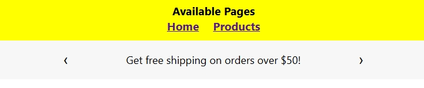
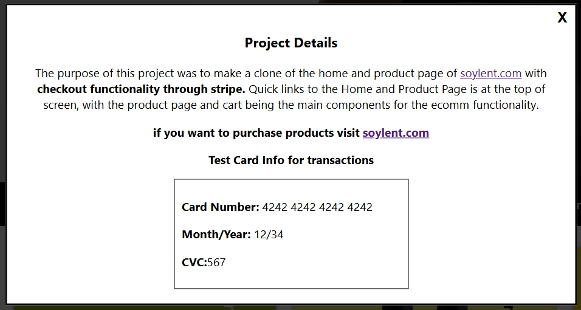
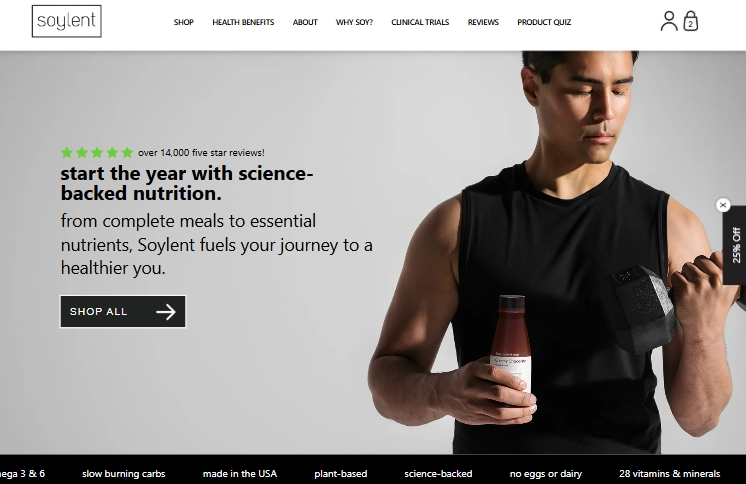
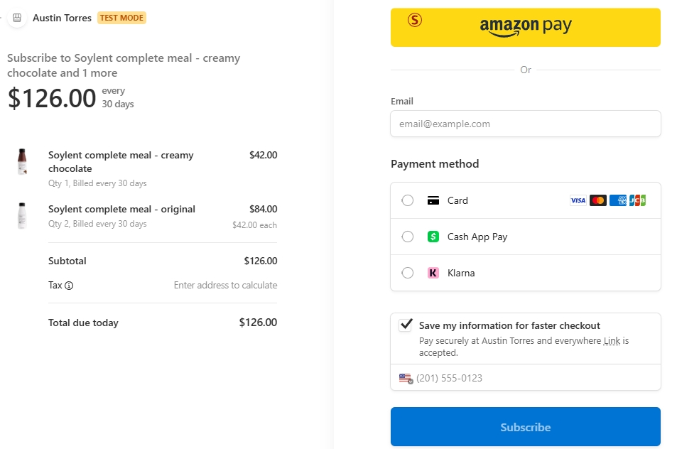
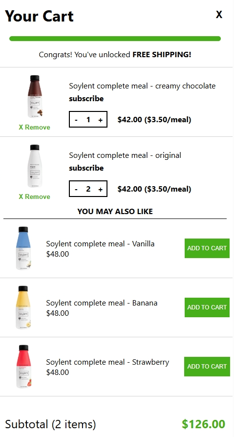
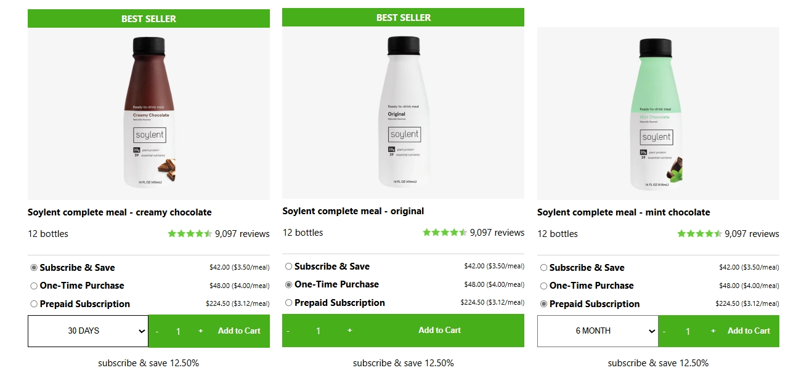

<h1>Soylent E-Commerce React Clone</h1>

<!-- Banner Image Placeholder -->
<!-- Replace with an image like /public/readMeBanner.png -->

A full-scale e-commerce clone inspired by **Soylent.com**, built to recreate a modern direct-to-consumer shopping experience.  
This project includes **animated product browsing**, **add-to-cart functionality**, and a real **checkout flow powered by Stripe**, all wrapped in a UI thats as close to the official soylent design as possible.

Developed using **React** on the frontend and a secure **Express.js backend** to simulate real-world payment processing.

<ul>
  <li>Built with React and Express.js</li>
  <li>Custom product pages and cart logic</li>
  <li>Integrated with Stripe Checkout (test mode)</li>
  <li>Responsive layout inspired by Soylent’s design system</li>
  <li>Focus on smooth UX with animations and transitions</li>
  <li>Secure backend routes for payment processing, with accurate pricing to the products</li>
  <li>Goal: Replicate a professional e-commerce experience from browsing to checkout</li>
  <li>Uses local storage to save products added to cart</li>
</ul>

<h2>Deployed on Netlify – <a href="https://symphonious-frangipane-463737.netlify.app/">Live Soylent E-Commerce Clone</a></h2>

<a href="https://symphonious-frangipane-463737.netlify.app/">Visit the Live Site</a>
<!-- ========== UI Showcase Section (Add Images Later) ========== -->
<!-- Quick Nav -->

Quick Nav to quickly go through the two created pages

<!-- Test Credit Card and project details -->

Project details as well as test credit card numbers to check out using stripes payment gateway

<!-- Homepage Screenshot -->

Clean, minimalist storefront remake of Soylent’s original layout. Users can browse featured products and learn more about Soylents Products and Ingredients.

<!-- Animated Screenshot -->

One of many animated sections within the site

<!-- Cart & Checkout Screenshot -->

Full checkout simulation powered by Stripe, using a secure Express backend to manage transactions, supporting subscription purchases, one-time purchases and prepaid subscriptions.

<!-- Product Page Screenshot -->

Each product page includes pricing, flavor options, descriptions, and “Add to Cart” functionality using local storage.

<!-- ========== TECH SECTION ========== -->
<h2>Tech Used</h2>
<ul>
  <li>HTML</li>
  <li>CSS</li>
  <li>JavaScript</li>
  <li>React</li>
  <li>Express.js</li>
  <li>Stripe API (Checkout)</li>
  <li>Netlify Deployment</li>
</ul>

<!-- ========== ABOUT ME ========== -->
<h2>About Me</h2>

Thanks for taking the time to view this project! I built it to deepen my understanding of full-stack e-commerce flows — from frontend animations to secure backend payments.

I’m currently open to new opportunities in Frontend or Full-Stack Development.

<strong>My Links:</strong> 
<a href="mailto:austintorres578@gmail.com">austintorres578@gmail.com</a> 
<a href="https://austintorres578.github.io/Web-dev-portfolio/">Portfolio Site</a> 
<a href="https://github.com/austintorres578">GitHub</a> 
<a href="https://www.linkedin.com/in/austin-torres-55696420a/">LinkedIn</a>
